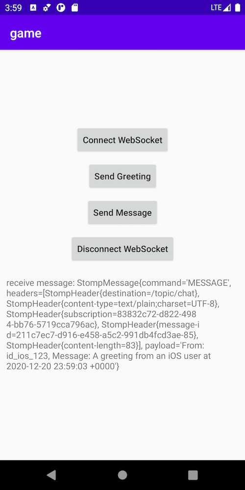

# Android client

A sample of playing WebSocket using [StompProtocolAndroid](https://github.com/NaikSoftware/StompProtocolAndroid).

## Get Started

Step 1: Open Android Studio

Step 2: File -> Open -> game/android-client

Step 3: Run on an emulator

### Connected

### Receive a message from iOS client

