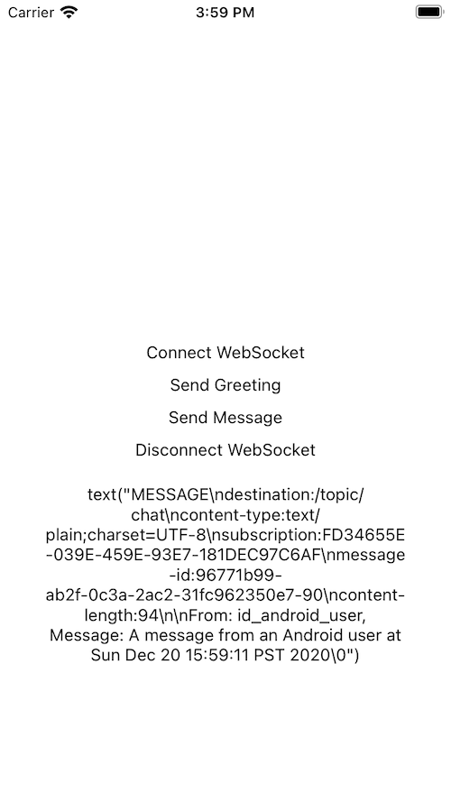

# iOS client

A sample of playing WebSocket using [Starscream](https://github.com/daltoniam/Starscream).

## Get Started

Step 1: Open Xcode

Step 2: File -> Open -> game/ios-client

Step 3: Run on a simulator

### Connected

### Receive a message from Android client

